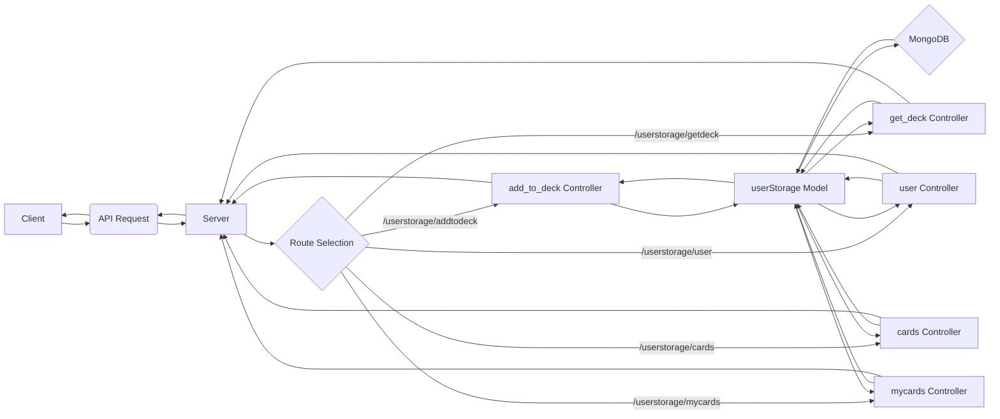
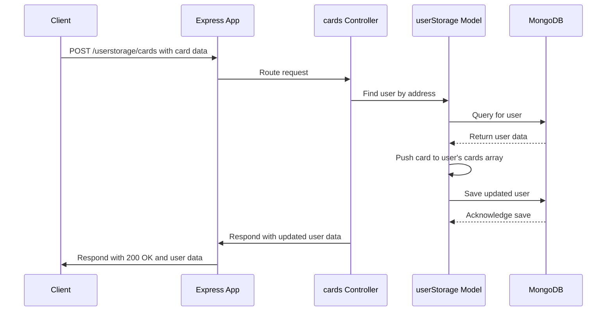
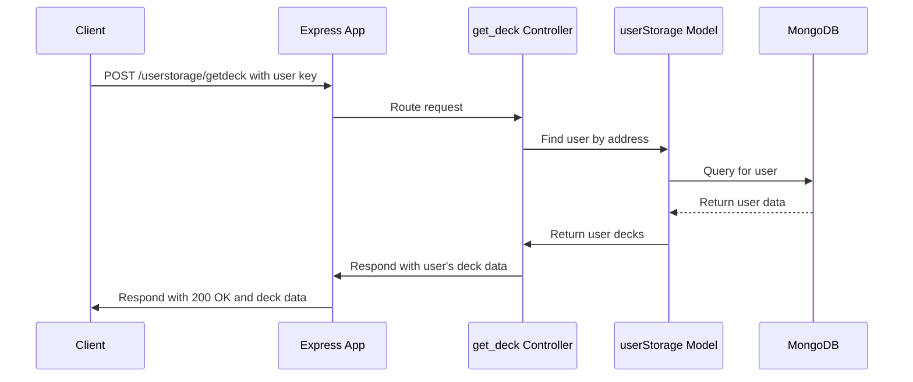
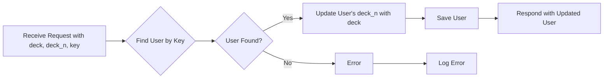
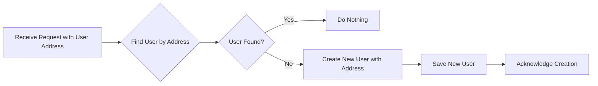
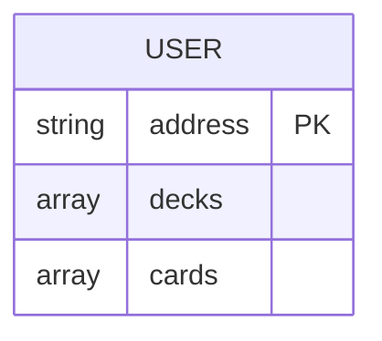

# Project Documentation: Pokemon Game Client and Server

## Overall Overview:

This project appears to be a Pokemon game or trading card game application with a client-server architecture. The client-side, built with React and Vite, provides the user interface for interacting with the game.  The server-side, built with Node.js, Express, and MongoDB, handles data persistence and user storage.

The client interacts with the server through API endpoints to perform actions such as:

*   Storing user decks.
*   Retrieving user decks.
*   Storing individual cards.
*   Retrieving user cards.
*   Creating user profiles.

The separation of concerns between the client and server allows for a scalable and maintainable application. The client focuses on rendering the user interface and handling user input, while the server focuses on managing data and handling business logic.

## File/Module-Level Details:

### Client-Side

*   **File:** `.eslintrc.cjs`
    *   **Language:** JavaScript
    *   **Description:** ESLint configuration file for linting and code style enforcement. It extends recommended React and JavaScript rules and configures the environment for browser and ES2020.
    *   **Notable:** Disables `react/jsx-no-target-blank` rule.

*   **File:** `index.html`
    *   **Language:** HTML
    *   **Description:** The main HTML file that serves as the entry point for the React application.  It links to the main JavaScript file (`/src/main.jsx`) and includes a link to a Google Font.
    *   **Notable:** Includes a `div` with id "root" where the React application will be rendered.

*   **File:** `postcss.config.js`
    *   **Language:** JavaScript
    *   **Description:** Configuration file for PostCSS, a tool for transforming CSS with JavaScript. It uses Tailwind CSS and Autoprefixer.
    *   **Notable:** Integrates Tailwind CSS for utility-first styling.

*   **File:** `tailwind.config.js`
    *   **Language:** JavaScript
    *   **Description:** Tailwind CSS configuration file.  It specifies the content files to be scanned for Tailwind classes and defines theme extensions.
    *   **Notable:** Defines a custom background color `customBackground`.

*   **File:** `vite.config.js`
    *   **Language:** JavaScript
    *   **Description:** Vite configuration file.  Vite is a build tool that provides fast development and optimized builds. This configures the React plugin.
    *   **Notable:** Uses `@vitejs/plugin-react` for React support.

*   **File:** `src/index.css`
    *   **Language:** CSS
    *   **Description:** Main CSS file for the application.  It imports Tailwind CSS layers and defines custom CSS utilities and animations.
    *   **Notable:** Defines background images for different sections, animations like `bounce` and `fadeIn`, and a utility class to hide scrollbars.

### Server-Side

*   **File:** `index.js`
    *   **Language:** JavaScript
    *   **Description:** Main entry point for the Node.js server.  It sets up the Express app, connects to MongoDB, and defines API routes.
    *   **Notable:** Uses `dotenv` for environment variable configuration, `cors` for cross-origin resource sharing, and imports the `userStorage` routes.

*   **File:** `controllers/userstorage.controllers.js`
    *   **Language:** JavaScript
    *   **Description:** Contains the controller functions for handling user storage related requests.  These functions interact with the `userStorage` model to perform database operations.
    *   **Notable:** Includes functions for `add_to_deck`, `get_deck`, `user` (creating if not exists), `cards` (adding cards), and `mycards` (retrieving cards).

*   **File:** `models/userstorage.models.js`
    *   **Language:** JavaScript
    *   **Description:** Defines the Mongoose schema and model for storing user data in MongoDB.
    *   **Notable:** The schema includes fields for `address`, `decks`, and `cards`.

*   **File:** `routes/userstorage.routes.js`
    *   **Language:** JavaScript
    *   **Description:** Defines the API routes for user storage related operations.  It maps HTTP requests to the corresponding controller functions.
    *   **Notable:** Includes routes for `addtodeck`, `user`, `cards`, `mycards`, and `getdeck`.

## Key Functions and Components:

*   **React Components (Client-Side):**  The React components (code not provided) are responsible for rendering the user interface, handling user input, and making API requests to the server. They would manage the state of the application and update the UI accordingly.
*   **Express App (Server-Side):** The Express application handles HTTP requests from the client, routes them to the appropriate controller functions, and sends responses back to the client.
*   **Mongoose Model (Server-Side):** The `userStorage` model defines the structure of the user data that is stored in MongoDB.  It provides methods for querying and manipulating user data.
*   **Controller Functions (Server-Side):** The controller functions in `userstorage.controllers.js` handle the business logic for user storage related operations. They interact with the `userStorage` model to perform database operations and send appropriate responses back to the client.

## Implementation Details:

*   **Error Handling:** The server-side code uses `try...catch` blocks to handle errors.  Errors are logged to the console.  More robust error handling and logging would be beneficial for production environments.
*   **File Structure Conventions:** The project follows a standard file structure with separate directories for client-side and server-side code, as well as for models, controllers, and routes on the server-side.
*   **Data Flows:**
    1.  User interacts with the React components on the client-side.
    2.  React components make API requests to the server using HTTP methods (POST).
    3.  The Express app routes the requests to the appropriate controller functions.
    4.  Controller functions interact with the `userStorage` model to perform database operations (e.g., creating, reading, updating, deleting user data).
    5.  The server sends responses back to the client, typically in JSON format.
    6.  React components update the UI based on the received data.

## Visual Diagrams:

### End-to-End Data Flow:

### Sequence Diagram for Adding a Card:

### Sequence Diagram for Getting a Deck:

### Flowchart for `add_to_deck` Controller:

### Flowchart for `user` Controller:

### ER Diagram (Conceptual):

