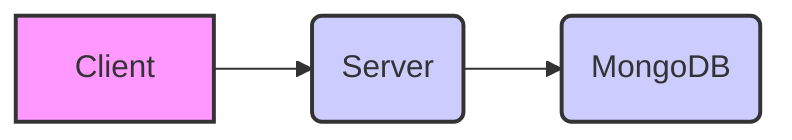
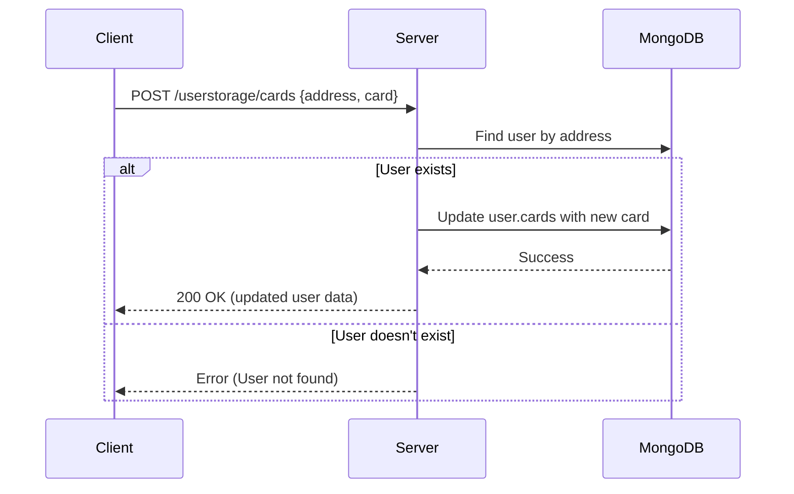
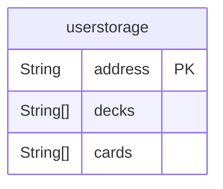

# Pokemon Project Documentation

## Overall Overview:

This project appears to be a web application centered around Pokemon, possibly involving card collection, deck building, and arena battles. The architecture follows a client-server model. The client-side, built with React and Vite, provides the user interface and handles user interactions. The server-side, built with Node.js, Express, and Mongoose, manages user data, including card collections and decks, and interacts with a MongoDB database. The project's goal is to provide a platform for users to manage their Pokemon cards, build decks, and potentially engage in battles.

The client and server communicate via HTTP requests. The client sends requests to specific API endpoints defined on the server (e.g., `/userstorage/addtodeck`), and the server responds with data, typically in JSON format. The server also uses CORS to enable cross-origin requests from the client, which is essential for the client to access the server's API.

## Incorporation of Existing Documentation:

There's no explicit project-level documentation provided besides the code itself.  This documentation aims to fill that gap by analyzing the code. The file names offer some implicit documentation, e.g., `userstorage.models.js` clearly defines the user data structure. The following sections will dive deeper into each component, expanding on these hints.

## File/Module-Level Details:

**Client-Side (React/Vite):**

*   **`.eslintrc.cjs` (JavaScript):** Configuration file for ESLint, a JavaScript linter.  It defines rules and guidelines for maintaining code quality and consistency. It extends recommended rules and plugins for React and React Hooks.

*   **`index.html` (HTML):** The main HTML file that serves as the entry point for the React application. It links to the main JavaScript file (`/src/main.jsx`) and includes a link to Google Fonts (`Press Start 2P`). It sets up the basic HTML structure with a root `div` element where the React application will be mounted. Includes a link to a favicon.

*   **`postcss.config.js` (JavaScript):** Configuration file for PostCSS, a tool for transforming CSS. It includes plugins for Tailwind CSS and autoprefixer.

*   **`tailwind.config.js` (JavaScript):** Configuration file for Tailwind CSS, a utility-first CSS framework. It specifies the content files to be processed by Tailwind and defines custom theme extensions, including a custom background color.

*   **`vite.config.js` (JavaScript):** Configuration file for Vite, a build tool for front-end web development. It specifies the plugins to be used, including the React plugin.

*   **`src/index.css` (CSS):**  Main CSS file, including Tailwind directives and custom CSS styles. Includes background images, animations, and scrollbar hiding.  The `@layer utilities` directive extends Tailwind with custom utility classes.

*   **`src/main.jsx` (JavaScript/JSX):** The main entry point for the React application. (Code not provided)

**Server-Side (Node.js/Express):**

*   **`index.js` (JavaScript):** The main server file.  It sets up the Express application, connects to the MongoDB database using Mongoose, defines middleware (CORS, JSON parsing), and mounts the user storage routes.

*   **`controllers/userstorage.controllers.js` (JavaScript):** Contains the controller functions for handling user storage-related API requests. These functions interact with the `userStorage` model to perform database operations.

*   **`models/userstorage.models.js` (JavaScript):** Defines the Mongoose schema for the `userstorage` model, which represents a user's data in the database. It specifies the data types for the user's address, decks, and cards.

*   **`routes/userstorage.routes.js` (JavaScript):** Defines the API routes for user storage-related operations. It maps HTTP requests (POST) to the corresponding controller functions.

## Key Functions and Components:

**Client-Side (React):**

*   **React Components (Code not provided):** The application likely utilizes various React components to build the user interface, manage state, and handle user interactions.
*   **Vite:** Serves as the bundler and development server.  Handles hot module replacement and optimizes the build for production.
*   **Tailwind CSS:** Provides a utility-first CSS framework for styling the application.

**Server-Side (Node.js/Express):**

*   **`index.js`:**  The central point for the server. It handles:
    *   Express app setup
    *   MongoDB connection with Mongoose using `dotenv` for environment variables.
    *   Middleware setup (`express.json()`, `cors()`).
    *   Route mounting (`/userstorage`).

*   **`userstorage.controllers.js`:** Contains the core logic for handling user data:
    *   **`add_to_deck(req, res)`:** Adds a deck to a user's collection of decks. It retrieves the user by address, updates the specified deck slot, and saves the changes to the database.
    *   **`get_deck(req, res)`:** Retrieves a user's decks based on their address.
    *   **`user(req, res)`:**  Creates a new user entry in the database if one doesn't already exist with the provided address. This seems to be a lazy initialization pattern.
    *   **`cards(req, res)`:** Adds a card to a user's collection of cards.
    *   **`mycards(req, res)`:** Retrieves a user's collection of cards.

*   **`userstorage.models.js`:** Defines the structure of the user data in the database.
    *   `address`: User's unique address (likely a wallet address).
    *   `decks`: An array of arrays, representing the user's decks.  It's initialized as an array of 4 empty arrays.
    *   `cards`: An array of cards the user owns.

*   **`userstorage.routes.js`:**  Defines the API endpoints for user storage operations.  These endpoints are mapped to the corresponding controller functions:
    *   `POST /userstorage/addtodeck`: Calls `add_to_deck`.
    *   `POST /userstorage/user`: Calls `user`.
    *   `POST /userstorage/cards`: Calls `cards`.
    *   `POST /userstorage/mycards`: Calls `mycards`.
    *   `POST /userstorage/getdeck`: Calls `get_deck`.

## Implementation Details:

*   **Error Handling:** The server-side code includes basic error handling with `try...catch` blocks. However, it primarily logs errors to the console.  More robust error handling and user-friendly error messages should be implemented.

*   **File Structure:** The project follows a common structure with separate directories for the client and server. Within the server directory, there are further subdivisions for models, controllers, and routes.

*   **Data Flows:**
    *   **User Creation:** When a new user accesses the application (and the backend), the client sends a POST request to `/userstorage/user` with the user's address. The server checks if the user exists; if not, it creates a new user entry in the database.
    *   **Adding Cards:**  When a user adds a card, the client sends a POST request to `/userstorage/cards` with the user's address and the card data. The server adds the card to the user's `cards` array in the database.
    *   **Retrieving Cards:**  When a user requests their cards, the client sends a POST request to `/userstorage/mycards` with the user's address.  The server retrieves the user's `cards` array from the database and sends it back to the client.
    *   **Adding to Deck:** The client sends a POST request to `/userstorage/addtodeck` including the deck, deck number and user address. The deck list is saved to the user's record on the specified deck number.
    *   **Getting Deck:** The client sends a POST request to `/userstorage/getdeck` including the user address. The server returns an array of the user's decks.

*   **Database:**  MongoDB is used as the database, accessed via Mongoose.  The `userstorage` model defines the schema for storing user data.

## Visual Diagrams:

### Architectural Diagram

### Data Flow for Adding a Card

### Database Diagram

## Future Considerations:

*   **Enhanced Error Handling:** Implement more comprehensive error handling on the server-side, including specific error codes and user-friendly error messages.
*   **Input Validation:** Add input validation to the server-side to prevent invalid data from being stored in the database.
*   **Authentication/Authorization:** Implement authentication and authorization to secure the API endpoints and protect user data.  Currently, the system relies solely on the user's address, which might be a security risk.
*   **Data Validation:** Add data validation on both client and server sides to ensure data integrity.
*   **Card Data Management:**  The current implementation stores cards as a simple array.  Consider using a more structured approach for managing card data, possibly with a separate `Card` model and relationships to the `userstorage` model. This would allow for more efficient querying and manipulation of card data.
*   **Real-time Updates:** Implement real-time updates using WebSockets to provide a more interactive user experience, especially for arena battles or marketplace interactions.
*   **Scalability:** Consider using a message queue (e.g., RabbitMQ, Kafka) to handle asynchronous tasks and improve the scalability of the application.
*   **Testing:** Implement unit tests and integration tests to ensure the quality and reliability of the code.
*   **Performance Optimization:**  Optimize database queries and code execution to improve performance, especially for large user collections.
*   **AI Integration:** Explore integrating AI modules for features such as:
    *   Card recommendation based on deck building.
    *   Opponent analysis during arena battles.
    *   Automated balancing of card stats.
